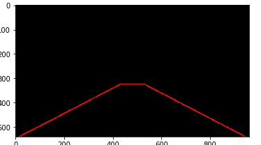

# **Finding Lane Lines on the Road** 

**Finding Lane Lines on the Road**

The goals / steps of this project are the following:
* Make a pipeline that finds lane lines on the road
* Reflect on your work in a written report
       
---

### Reflection

### 1. Describe your pipeline. As part of the description, explain how you modified the draw_lines() function.

My pipeline consisted of the followng steps     
1. Change the image to gray.
2. Blur the images to reduce noise with kernal 5, which it give better result
3. Detect Canny edge with 50, 180 for low and hight threshold respectfully, these the best value i found after testing it. also I need to eliminate more edges that are not stright
4. find the best region that very much fit most images on the testing vidoes. 



5. hough_lines, the number was taken from one of the quizes in the course 
6. draw lines on a color image

---


In order to draw a single line on the left and right lanes, I modified the draw_lines() function by the following

1. At first I assume that all lines with a slope > 0.1 is consider a right line, and < -0.1 a left line. Base on this assumation I get the average slope, variance, and the average of x1 of the left and right lines.     
I get the **average slope** in order to compare the slope of each line on left and right to their average slope. And if the number greate or less than average slope + ratio (is calculated based on the variance) then the line is removed.     
I get the **average of x1** for each line in order to check how far a line from other lines by comparing its x1 to the average x1s, and it should not be more than 150 (I got this number based on testing)    

2. Based on the value of average slope, ratio and average of x1s, keep all lines that do  meet the requirements


```
if (x2 != x1) and  (! abs(x1 - x1_average) > 150) and(average_slope-ratio <= slope <= average_slope+ratio):       
   lines.append([[x1,y1,x2,y2]])
``` 

3. After optaining the left and right lines, now we need to convert this to one line in order to draw on a lane. by calling **get_the_line** function
- sort lines.
- get the first and last lines
- extend the line by change the values of x1, x2, y1 and y2 

```
# an example see **get_extend_l_line** and **get_extend_r_line** for more details     
y1 = 539 # to extend the line to bottom 
x1 =  -int(((y2-y1)/ avg_slope) - x2)
y2 = 340 # extend the line to top 
x2 = int(((y2-y1) / avg_slope) + x1)
```

4. Finally draw the lines.

### 2. Identify potential shortcomings with your current pipeline


One potential shortcoming would be what would happen when lanes are not painted well on the streat, then it will be hard to find lanes edges. 

Another shortcoming could be the speed of the car. The fram imaged in the video  would have some bulr, which will make finding lanes hard for the edges

Also, when the car chagne lanes or truning left or right, the pipeline will not work correctly becuase the region would be differnt and drawing line by finding the slope could be more tricky


### 3. Suggest possible improvements to your pipeline

A possible improvement would be to modify selected region to work for all images. by only take the bottom have of the image

Another potential improvement.
1. After geting all possible right or left lines, I would exam each side right or left separately.
2. Take a line from the  right lines array as an example.
3. Get the slope of that line.
4. Take the next line from the right lines array.
5. get the slope of the another line.
6.  a. Compare the slopes of the two lines.
    b. if the thier values are closed to each other move to 7 otherwise go back to step 4
7. Draw a line between the two lines, and compare the slope of the new line with the average slopes of the other two lines 
8. If the slopes are cloded to then convert the three lines as a single line. 
9. Make this line as a base.
10. move to step 4 

howwever, this approche may fail if the actual lane has a steep curave

- connect potential lines find by hough for left or right
- 